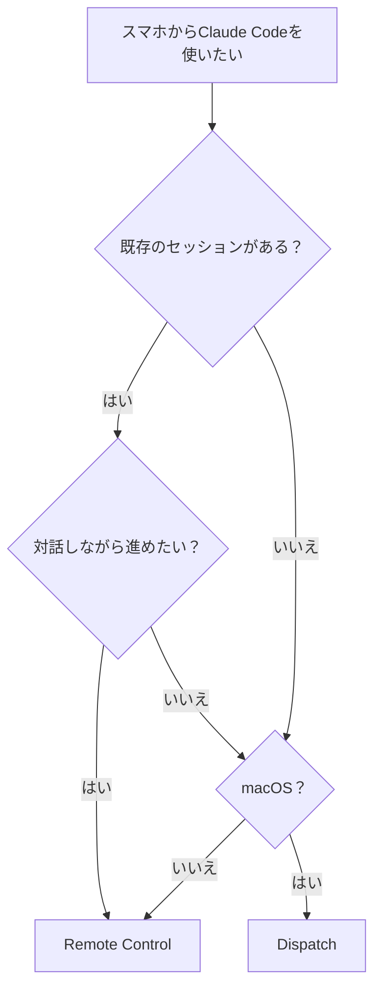

## スマホからコードを書く時代が来た

「リファクタリング、帰りの電車でやっておいて」

Claude Codeに、スマホからこう指示するだけで、自宅のマシンが勝手にコードを書き換えてくれる。2026年、開発者のワークフローは根本から変わった。

Anthropicが提供する**Remote Control**と**Dispatch**。どちらも「スマホからClaude Codeを操作する」機能だが、仕組みも用途もまったく違う。この記事では、両者の違いを明確にし、実践的な使い分けを解説する。

## Remote ControlとDispatchの違い

まず結論から。

| | Remote Control | Dispatch |
|---|---|---|
| **一言で** | 既存セッションをスマホから操作 | スマホからタスクを丸投げ |
| **起動方法** | `claude --rc` またはセッション中に `/rc` | Claude Desktopアプリ + スマホペアリング |
| **実行環境** | ターミナル（CLI） | Claude Desktop（macOS） |
| **セッション** | 既存セッションの延長 | 新規セッションを自動生成 |
| **操作性** | リアルタイムで対話 | タスクを投げて放置→完了通知 |
| **対応プラン** | Pro / Max / Team / Enterprise | Pro / Max のみ |
| **対応OS** | 全OS（CLIが動く環境） | macOSのみ |
| **Computer Use** | 非対応 | 対応（30分承認制） |
| **最適な場面** | 作業の続きをスマホで確認・操作 | 外出中にタスクを委任 |

### どちらを使うべきか？



## Remote Control — セットアップと使い方

### 基本の起動方法

3つの方法がある。

**方法1: セッション開始時に有効化**
```bash
claude --remote-control
# または短縮形
claude --rc
```

**方法2: 既存セッション内で有効化**
```
> /remote-control
# または
> /rc
```

**方法3: サーバーモード（常時待機）**
```bash
claude remote-control --name "my-dev-server" --spawn auto
```

起動するとURLが表示される。ブラウザで開くか、QRコードをスマホで読み取ればすぐに接続できる。

### セッションの永続化（重要）

Remote Controlの最大の落とし穴は、**マシンがスリープすると接続が切れる**こと。約10分のタイムアウトで再起動が必要になる。

対策は `tmux` + `caffeinate` の組み合わせ。

```bash
# tmuxセッションを作成（ターミナルを閉じても維持）
tmux new-session -d -s claude

# スリープ防止 + Claude Code起動
tmux send-keys -t claude 'caffeinate -i claude --rc' Enter
```

これで、ターミナルを閉じても、マシンがスリープしても、Claude Codeは動き続ける。

### セキュリティの仕組み

「外からアクセスできるなら危険では？」と思うかもしれないが、安全に設計されている。

- **アウトバウンド接続のみ** — インバウンドポートは開かない。ファイアウォール変更不要
- **TLS暗号化** — 全通信がHTTPS
- **短命クレデンシャル** — 各接続ごとに個別のトークンが発行され、自動失効
- **ローカル実行** — コードは一切クラウドに送られない

## Dispatch — セットアップと使い方

### 初期設定（2分で完了）

1. macOSに**Claude Desktop**アプリをインストール
2. **Coworkタブ**を開く
3. **Dispatch**をクリック
4. 表示されるQRコードをスマホの**Claudeアプリ**で読み取る

これで完了。以降、スマホのClaudeアプリからいつでもタスクを投げられる。

### タスクの投げ方

スマホからClaude Desktopに向けてメッセージを送るだけ。

```
「login-pageブランチのテストが落ちてるから直して」
```

Claudeが内容を判断し、開発タスクなら**Claude Codeセッション**を自動起動、ドキュメント作成なら**Cowork**で処理する。

完了するとスマホに**プッシュ通知**が届く。結果（修正内容、PR URL等）もそのまま確認できる。

### 明示的にCode セッションを指定

```
「Claude Codeセッションを開いて、依存パッケージを全部最新にアップデートして」
```

「Claude Codeセッションを開いて」と言えば、確実にCLI環境で実行される。

### 注意点

- **マシンが起動している必要がある** — スリープやアプリ終了でDispatchは停止
- **macOS限定** — Windows/Linuxは2026年3月時点で未対応
- **Pro/Maxプラン限定** — Team/Enterpriseは未対応

## 実践ワークフロー3選

### パターン1: 通勤中にリファクタリングを指示

```
朝の通勤電車（スマホ）
  ↓ Dispatchで指示: 「src/utils/の関数を全部テスト付きでリファクタして」
  ↓ 自宅のMac Desktopが自動実行
  ↓ 30分後、プッシュ通知: 「完了。12関数をリファクタ、テスト全パス」
会社到着後にPRを確認
```

**使用機能: Dispatch**

タスクを丸投げできる場面。結果だけ確認すればいい。

### パターン2: 進行中の作業をスマホで確認・修正

```
デスクでコーディング中 → 急な外出
  ↓ /rc でRemote Control有効化
  ↓ 外出先でスマホからclaude.ai/codeにアクセス
  ↓ 「さっきのAPI設計、認証ミドルウェアを追加して」
  ↓ リアルタイムで確認・指示
  ↓ 戻ったらデスクで続きを作業
```

**使用機能: Remote Control**

対話しながら進める場面。コンテキストが維持されるのがポイント。

### パターン3: 夜間の長時間タスクを放置実行

```
退勤前
  ↓ tmux + caffeinate + Remote Controlでサーバーモード起動
  ↓ スマホから指示: 「テストスイート全実行して、落ちたらデバッグして直して」
  ↓ 帰宅・就寝
  ↓ 翌朝、結果を確認
```

**使用機能: Remote Control（サーバーモード）**

```bash
tmux new-session -d -s overnight
tmux send-keys -t overnight 'caffeinate -i claude remote-control --name "overnight-task" --spawn auto' Enter
```

## トラブルシューティング

### 「Remote Controlが有効にならない」

`~/.claude/settings.json` で telemetry が無効になっていると動作しない。

```json
// これがあると動かない
{
  "DISABLE_TELEMETRY": true
}
```

Remote Controlはサーバーとの通信が必須のため、telemetryの無効化と競合する。

### 「スリープで接続が切れる」

```bash
# macOS: スリープ防止
caffeinate -i claude --rc

# Linux: systemd-inhibit
systemd-inhibit --what=idle claude --rc
```

### 「Dispatchの通知が来ない」

- スマホのClaudeアプリの通知設定を確認
- Claude Desktopアプリが起動していることを確認
- Macのスリープ設定を確認（System Settings → Energy）

## Team/Enterpriseでの管理

Team/Enterpriseプランでは、管理者がRemote Controlの利用を制御できる。

- **Admin Settings → Claude Code → Remote Control** トグルで有効/無効を切り替え
- Dispatchは現時点でTeam/Enterprise未対応

## まとめ

| やりたいこと | 使う機能 |
|-------------|---------|
| 既存セッションの続きをスマホで | Remote Control |
| 新しいタスクを丸投げしたい | Dispatch |
| リアルタイムで対話しながら進めたい | Remote Control |
| 結果だけ確認したい | Dispatch |
| Linux/Windowsマシンを操作 | Remote Control |
| Computer Useを使いたい | Dispatch |

どちらか一方ではなく、**場面に応じて使い分ける**のが正解だ。

朝の通勤でDispatchにタスクを投げ、昼休みにRemote Controlで進捗を確認し、帰りの電車でまたDispatchに次のタスクを委任する。24時間、開発が止まらない。

## もっと深く学びたい方へ

Claude Codeの活用法をさらに体系的に学びたい方は、以下の書籍がおすすめです。

📘 **[Claude Codeで会社を動かす — AIエージェント経営の実践記録](https://zenn.dev/joinclass/books/claude-code-ai-ceo)**
CEO1名+AIで6プロダクトを運営する実践ノウハウ。Remote Controlを活用した日常の開発フローも紹介。

📘 **[CLAUDE.md設計パターン — AIエージェントを思い通りに動かす実践ガイド](https://zenn.dev/joinclass/books/claude-md-design-patterns)**
Claude Codeをプロジェクトに最適化するCLAUDE.mdの設計パターン集。

📘 **[Claude Codeマルチエージェント開発 — 設計・実装・運用の実践ガイド](https://zenn.dev/joinclass/books/claude-code-multi-agent)**
複数のAIエージェントを協調させるアーキテクチャ設計。Dispatchとの組み合わせも有効。

📕 全書籍一覧は **[こちら](https://zenn.dev/joinclass?tab=books)**
