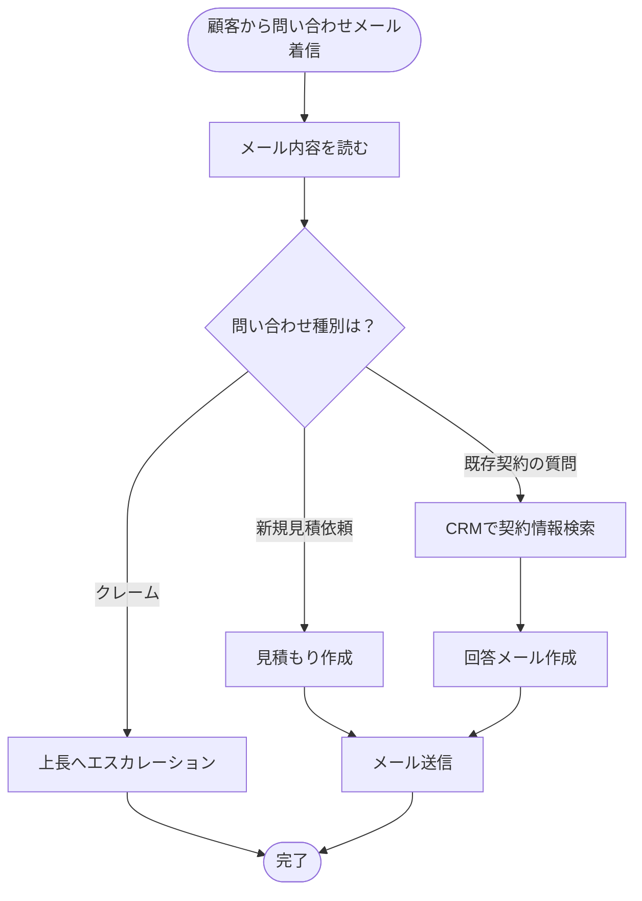
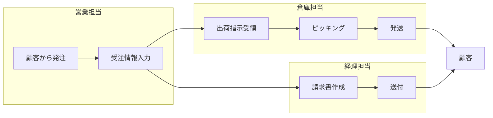
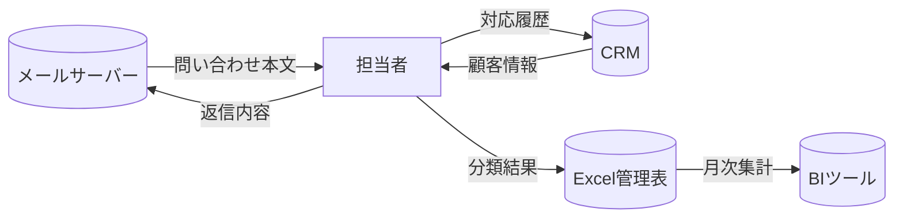
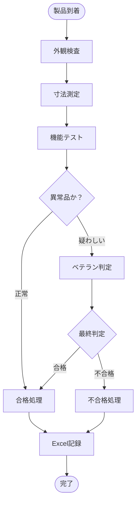

# As-Is業務フローの可視化

## この章で学ぶこと

- なぜAs-Is可視化が「**To-Be設計の前段階**」ではなく「**現場合意形成のツール**」なのかという本質理解
- BPMN風シンプル記法による業務フロー図の描き方（ツール: Mermaid / Miro / draw.io）
- 業務粒度の決定基準（細かすぎず粗すぎない「**ちょうど良い解像度**」の見極め）
- 課題マップ・データフロー図・ステークホルダーマップの3点セットによる多角的可視化
- 現場レビューを通じてAs-Is図を「**動く資産**」に育てる進め方

## はじめに -- As-Is可視化の本当の役割

「As-Is業務フローを書きましょう」と言うと、多くのコンサルタントや業務改善担当者は、**「To-Beを設計する前の現状整理ステップ」**という認識を持つ。

しかし筆者は、**As-Is可視化の最大の価値は「現場との合意形成」**にあると考えている。

可視化されたフロー図を現場に見せると、必ず以下のような反応が出てくる。

> 「ここ、実は違うやり方をしている人もいます」
> 「この工程、最近変わったんです」
> 「この判断は、Aさんしかできないんです」

つまり、**フロー図を書いて見せること自体が、現場の暗黙知を引き出す追加のヒアリング**になる。

そして、最終的に現場全員が「**これがうちの業務です**」と合意できる図ができれば、それは強力なプロジェクト資産になる。To-Be設計でも、PoC開発でも、UATでも、この図に立ち戻って判断できる。

:::message
**筆者の実践メモ**
筆者が支援した案件で、最も成功率が高いのはAs-Is図のレビューに**最低3回**時間を割いている案件だ。「現場が見て、修正して、合意する」というプロセスを丁寧に踏むことで、後工程の手戻りが激減する。
:::

## 業務フロー図のシンプル記法

### なぜBPMNフル仕様を使わないのか

BPMN（Business Process Model and Notation）は業務フロー記述の標準規格だが、フル仕様を使うと記号が多すぎて現場が読めない。**現場が読めない図は資産にならない**。

筆者は以下の**5つの記号**だけを使う「シンプルBPMN」を推奨する。

| 記号 | 意味 | 例 |
|------|------|----|
| 丸（○） | 開始・終了 | 業務開始、業務完了 |
| 四角（□） | 作業（タスク） | 「請求書を確認する」 |
| 菱形（◇） | 判断（分岐） | 「金額>10万円か？」 |
| 矢印（→） | フローの方向 | タスク間の遷移 |
| レーン（||） | 担当者・部署 | 営業担当 / 経理担当 |

この5つだけで、ほぼ全ての業務フローが書ける。

### Mermaidを使ったフロー図の例

筆者はMermaid記法を多用している。テキストベースなのでGit管理しやすく、変更履歴が残せる。



このようなフロー図をMarkdownに埋め込むことで、ドキュメントとフロー図を同じファイルで管理できる。

### スイムレーン形式で担当者を明示

複数の担当者・部署が関わる業務は、**スイムレーン形式**で描くと関係性が明確になる。



この形式で書くと、「**情報が誰から誰へ渡るか**」「**どこで滞留が発生しやすいか**」が一目で分かる。

## 業務粒度の決定基準

可視化で最も難しいのは「**どのくらい細かく書くか**」の判断だ。粒度が違うと、見る人によって有用度が大きく変わる。

### 粒度の3レベル

| レベル | 用途 | 粒度の目安 |
|--------|------|----------|
| L1: 経営層向け | 全体像の俯瞰 | 1業務=5-10ステップ |
| L2: 改善担当向け | 課題の特定 | 1業務=15-30ステップ |
| L3: 現場担当向け | 具体的作業の確認 | 1業務=50-100ステップ |

L1〜L3を**段階的に詳細化**するのが理想だが、時間に限りがあるなら**L2を中心**にする。

### L2粒度の具体例

「顧客からの問い合わせメール対応」をL2粒度で書くと、以下のようになる。

```
1. メールクライアントを開く
2. 未読メール一覧を見る
3. 優先度の高そうなものを選ぶ
4. メール本文を読む
5. 内容を分類する（新規/既存/クレーム/その他）
6. 必要に応じてCRMで顧客情報を検索する
7. 過去の対応履歴を確認する
8. 返信内容を考える
9. テンプレートから返信文を選ぶ
10. 顧客固有の情報で文面をカスタマイズする
11. 上長への確認が必要か判断する
12. （必要なら）上長に確認依頼を送る
13. 返信メールを送信する
14. CRMに対応履歴を記録する
15. 完了フラグを立てる
```

これくらいの粒度で書くと、「**どの工程がAIで自動化できそうか**」が見えてくる。例えば「5. 内容を分類する」「9. テンプレートから返信文を選ぶ」「14. CRMに対応履歴を記録する」などが候補になる。

逆に、L1（5-10ステップ）の粒度で書いてしまうと、自動化候補が見えない。

### 粒度が細かすぎると起きる問題

L3粒度で全業務を書こうとすると、以下の問題が起きる。

- ドキュメント作成に1-2週間取られる
- 現場が「**ここまで細かく書く意味があるのか**」と疑問を持つ
- 些細な手順違いで「**この図は古い**」と言われ、信頼性が下がる
- 全体像が見えなくなる

そのため、**全体はL2で書き、特に重要な工程だけL3で深掘り**するのが現実的だ。

## 課題マップの作成

業務フロー図に加えて、**課題マップ**を作る。これは「**どの工程に、どんな種類の痛みがあるか**」を一覧化したものだ。

### 課題マップのテンプレート

```markdown
# 業務名: 顧客問い合わせメール対応

| 工程 | 月間時間 | 痛みの種類 | 影響範囲 | 優先度 |
|------|---------|----------|---------|--------|
| 5. 内容を分類する | 15h | 単純作業の繰り返し | 担当者の集中力低下 | 高 |
| 6. CRMで顧客情報検索 | 10h | システム切り替え | 操作ミス | 中 |
| 9. テンプレート選択 | 5h | 判断負担 | 新人が間違える | 中 |
| 10. 文面カスタマイズ | 20h | 個別対応 | 残業の原因 | 高 |
| 14. CRMに履歴記録 | 8h | 二重入力 | 入力漏れ多発 | 高 |

## 痛みの種類の凡例
- 単純作業: 思考を伴わない繰り返し
- 判断負担: 経験を要する判断
- 二重入力: 同じ情報を複数システムに入力
- システム切り替え: 複数システムを行き来する
- 手戻り: 後工程でやり直しが発生
```

このマップを作ると、AI適用判断の優先順位付けがしやすくなる。

### 痛みの分類（5種類）

筆者は痛みを以下の5つに分類している。

1. **単純作業の繰り返し** → AI自動化が最も効きやすい
2. **判断負担** → AIアシスト（候補提示）が有効
3. **二重入力** → API連携で完全自動化可能
4. **システム切り替え** → 統合エージェントで効率化
5. **手戻り** → 上流で予防ガードを入れる

それぞれに最適なAI活用パターンが異なるため、痛みを分類することで、後の章のAI適用判断がスムーズになる。

## データフロー図の作成

業務フロー図が「**人の動き**」を表すのに対し、データフロー図は「**情報の動き**」を表す。

AI導入では、**情報がどこからどこへどんな形で流れているか**を理解することが極めて重要だ。なぜなら、AIに何かをさせるには、必ず**入力データ**が必要で、結果は**何らかの形で出力**される必要があるからだ。

### データフロー図の例



この図を書くと、以下が見えてくる。

- どんなシステムが関わっているか
- データはどんな形式（メール本文/CRMレコード/Excel行）か
- データの**サイロ**（孤立している場所）はどこか
- API連携できそうな箇所はどこか

特に「**サイロ**」の特定は重要だ。Excelで管理されている情報は、AIから直接アクセスしづらい。これを把握しておくと、To-Be設計で「**Excelをやめてデータベース化する**」という選択肢が見える。

## ステークホルダーマップの作成

業務フロー図・課題マップ・データフロー図に加えて、**ステークホルダーマップ**を作る。これは「**誰がこのプロジェクトに関心を持っているか**」を整理したものだ。

### ステークホルダーマップのテンプレート

```markdown
# プロジェクト: 顧客問い合わせ対応のAI化

## 経営層
| 役職 | 関心事 | 期待効果 | 不安事項 |
|------|-------|--------|---------|
| 社長 | コスト削減 | 月間50万円削減 | 顧客満足度低下 |
| 営業部長 | 売上機会の損失防止 | 応答時間短縮 | 営業情報の漏洩 |

## 業務オーナー
| 役職 | 関心事 | 期待効果 | 不安事項 |
|------|-------|--------|---------|
| カスタマーサクセス課長 | チーム残業削減 | 残業20h→5h | 教育コスト |

## 現場担当
| 役職 | 関心事 | 期待効果 | 不安事項 |
|------|-------|--------|---------|
| CS担当A | 自分の仕事 | 単純作業からの解放 | 自分の仕事が無くなる |
| CS担当B | 自分の仕事 | クレーム対応に集中できる | AIの誤回答 |

## システム関係者
| 役職 | 関心事 | 期待効果 | 不安事項 |
|------|-------|--------|---------|
| 情シス | セキュリティ | 統制強化 | API連携の保守負担 |
| 法務 | コンプライアンス | 監査ログ確保 | 顧客情報の取扱 |

## 影響を受ける関連部署
| 部署 | 関心事 | 期待効果 | 不安事項 |
|------|-------|--------|---------|
| 営業部 | 顧客情報の正確性 | 引き継ぎ精度向上 | 営業現場が振り回される |
| 経理部 | 請求関連の正確性 | 入力精度向上 | 改修コスト |
```

このマップがあると、**プロジェクトの説明・承認・調整**がスムーズになる。「**社長は何を気にしているか**」「**現場は何を不安に思っているか**」を一覧で把握できる。

## 可視化ツールの選定

業務フロー図の作成ツールは多数あるが、以下の3つを推奨する。

### 1. Mermaid（テキストベース）

**推奨用途**: Git管理が必要なプロジェクト、エンジニアが多いチーム

**メリット**:
- テキストで書ける（バージョン管理しやすい）
- GitHub/GitLab/Notionで自動レンダリング
- 学習コスト低

**デメリット**:
- 細かいレイアウト調整が難しい
- 大規模な図には不向き

### 2. Miro / FigJam（ホワイトボード型）

**推奨用途**: 現場と共同編集する場面

**メリット**:
- 直感的な操作
- 付箋・コメントが追加しやすい
- 複数人での同時編集が快適

**デメリット**:
- 有料プラン必要（無料版は3ボードまで等の制限）
- 後で形式を統一しにくい

### 3. draw.io（diagrams.net）

**推奨用途**: 図のクオリティを重視するドキュメント

**メリット**:
- 無料・Webブラウザで動作
- BPMNテンプレートが充実
- 印刷品質の高い図が作れる

**デメリット**:
- 共同編集はGoogle Drive経由が必要
- 学習コストやや高め

### ツール組み合わせの推奨パターン

筆者の場合、**Mermaidで管理用、Miroで現場ワークショップ用**の使い分けをしている。

最終成果物はMermaidで残し、現場との議論はMiroで行う。Miroで合意したものをMermaidに転記する流れだ。これにより「**動かしやすさ**」と「**管理しやすさ**」を両立できる。

## 現場レビューの進め方

可視化した図は、必ず**現場と一緒にレビュー**する。机上で完成させてはいけない。

### レビュー会の設計（90分）

```
0:00 - 0:10  目的説明・前提共有
0:10 - 0:30  As-Is業務フロー図の説明（こちらから読み上げる）
0:30 - 1:00  現場からの修正・追加コメント
1:00 - 1:20  課題マップの優先度合意
1:20 - 1:30  次のステップ確認
```

### レビュー会の進行のコツ

#### コツ1: 「**間違っているところを教えてください**」と明示する

「**正しいか確認してください**」だと現場は遠慮して指摘しない。「**間違っているところ・違うやり方もあるところを指摘してください**」と言うと、活発な指摘が出る。

#### コツ2: その場で図を書き換える

修正コメントが出たら、**その場で図を更新**する。「持ち帰って直します」だと、次回までに記憶が曖昧になる。

Miroなら直接編集できる。Mermaidなら画面共有しながらコードを修正する。

#### コツ3: 「**例外パス**」を必ず聞く

通常パスだけでなく、「**この判断で**No**だった場合はどうしますか？**」「**システムが落ちていたらどうしますか？**」など、例外パスを必ず聞く。

例外パスにこそ、現場の暗黙知が詰まっている。

#### コツ4: 「**最近変わったこと**」を聞く

「**この業務、最近変わったところはありますか？**」と最後に聞く。組織変更・システム入替え・人事異動などで、暗黙的に業務が変わっていることがある。

#### コツ5: レビュー後24時間以内に図を更新

レビュー会の翌日までに、議論した内容を反映した図を作成し、参加者に共有する。**スピード感**が現場の信頼を獲得する。

## As-Is可視化の完了判断（チェックリスト）

```
□ 業務フロー図がL2粒度で完成している
□ 担当者・関連システムが明示されている
□ 現場レビューを最低2回実施した
□ 課題マップが完成しており、優先度が合意できている
□ データフロー図が作成され、サイロが特定されている
□ ステークホルダーマップが作成されている
□ 業界用語・略語の凡例が整備されている
□ 例外パスが3つ以上記載されている
□ 図のバージョン管理が始まっている
□ 次フェーズ（To-Be設計）に進む合意が取れている
```

8項目以上にチェックが入れば、次フェーズに進んでよい。

## ケーススタディ: 製造業の品質管理工程の可視化

筆者が支援した製造業の品質管理工程を、参考までに紹介する。

### ヒアリングで判明した業務概要

- 製品ライン3本、品質検査担当者5名
- 1日あたり検査件数: 約200件
- 検査内容: 外観検査、寸法測定、機能テスト
- 異常品の判定: 経験10年以上のベテランしかできない

### As-Is業務フロー（簡略版）



### 課題マップ

| 工程 | 月間時間 | 痛みの種類 | 優先度 |
|------|---------|----------|--------|
| 外観検査 | 80h | 単純作業 | 高 |
| 寸法測定 | 60h | 単純作業（手書き記録） | 高 |
| ベテラン判定 | 30h | 属人化 | 最高 |
| Excel記録 | 40h | 二重入力 | 高 |

### To-Beへの示唆（次章で詳述）

- 外観検査: **画像認識AI**による一次判定→ベテランは疑わしい品のみ
- 寸法測定: 測定機からの**自動データ取得**
- ベテラン判定: **判定基準のAI学習**による属人化解消
- Excel記録: 検査機器から**自動連携**

このような可視化を経ることで、To-Be設計時の判断が論理的にできるようになる。

## まとめ

- As-Is可視化の最大の価値は「**現場との合意形成**」にある
- 5記号のシンプルBPMNとMermaidで、現場が読める図を作る
- 粒度はL2（業務あたり15-30ステップ）が現実的
- 業務フロー図・課題マップ・データフロー図・ステークホルダーマップの**4点セット**で多角的に可視化する
- 現場レビューを最低2回実施し、その場で修正・合意する
- 例外パス・暗黙知を引き出すことが、後工程の質を決める

## 次章への導線

第4章では、As-Isで可視化した業務に対して**To-Beモデルを設計**し、**AI適用判断**を行う手法を扱う。

具体的には:
- AIで自動化すべき業務とすべきでない業務の判別基準
- AI適用パターン（全自動 / 半自動 / アシスト / 並列）の選択
- ROI計算フレームワーク（時間削減・品質向上・創出効果）
- To-Be業務フロー図の描き方
- 現場合意の取り方

を解説する。As-Isは「**今**」、To-Beは「**未来**」。両者をつなぐのが**AI適用判断**である。

---

**関連書籍**

- 『Claude Code仕事の教科書』(Zenn) — 個人レベルの業務改善視点で補完
- 全書籍一覧: https://zenn.dev/joinclass?tab=books

**AIコンサル無料診断**: https://joinclass.co.jp/#cta
