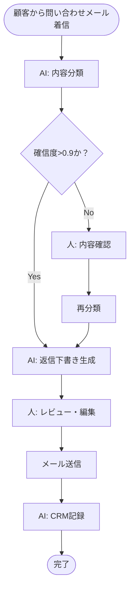
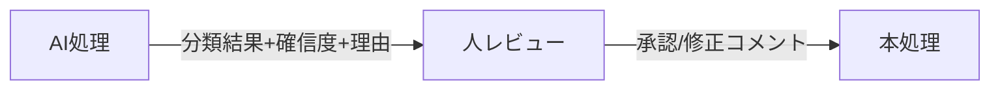
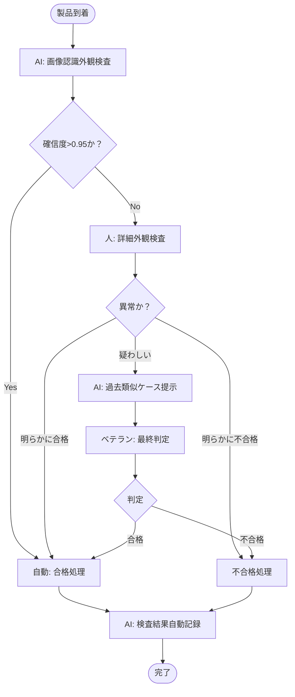

# To-Beモデル設計とAI適用判断

## この章で学ぶこと

- As-Is業務に対して「**AI適用すべきか / 別手段が良いか**」を論理的に判断する5軸フレームワーク
- AI適用パターンの4類型（全自動 / 半自動 / アシスト / 並列実行）と適用条件
- ROI計算の3要素（時間削減・品質向上・創出効果）と現実的な見積もり方
- To-Be業務フロー図に「**AI適用ポイント**」を明示する書き方
- 経営層・現場・情シスへの提案資料の作り方
- 投資対効果を「**数字で語れる**」ための実用テンプレート

## はじめに -- なぜAI適用判断は「合理的」より「現実的」が重要か

To-Be設計で最もよく見るパターンは、「**ヒアリングで聞いた痛みを全部AIで解決します**」という壮大な提案だ。

これは合理的に見えて、実は失敗の道である。なぜなら、AI適用には以下のような**現実的な制約**があるからだ。

- AI APIには利用料金がかかる（月間処理量によっては予算オーバー）
- AIの精度は100%ではない（誤答時のリカバリ設計が必要）
- 業務システムとの連携にはAPI整備が必要（既存システムによっては不可能）
- 現場の運用習慣を変える必要がある（変化抵抗のコスト）
- 法規制・社内規定の確認が必要（特に金融・医療等）

これらを無視して「**全部AIで自動化**」と提案すると、PoCで頓挫するか、本番運用で破綻する。

To-Be設計の本質は、「**理想**」を描くことではなく、「**手の届く理想**」を描くことだ。これを筆者は「**現実的To-Be**」と呼んでいる。

:::message
**筆者の実践メモ**
筆者が支援した案件で、最も成功率が高いのは「**AI適用範囲を意図的に狭めた案件**」だ。「最初は1工程だけAI化」と決め、それを確実に成功させてから次の工程に広げる。最初から3-5工程を一気にAI化しようとした案件は、ほぼ全て頓挫している。
:::

## AI適用判断の5軸フレームワーク

筆者が実プロジェクトで使っている、AI適用判断のための5軸フレームワークを紹介する。

### 5軸

1. **作業の構造化度** - 入力・処理・出力のフォーマットが揃っているか
2. **判断の重要度** - 誤判定の影響範囲は大きいか
3. **データの可用性** - 学習・検証に使えるデータがあるか
4. **頻度・ボリューム** - ROIを正当化できる業務量があるか
5. **代替手段の有無** - AI以外の方法（RPA、Excel関数等）でも解決できるか

各軸を1-5でスコアリングし、合計点で判断する。

### スコアリング表

| 軸 | スコア5（AI向き） | スコア3（中間） | スコア1（不向き） |
|----|--------------|------------|--------------|
| 構造化度 | 入出力フォーマット明確 | 半構造化（メール等） | 完全非構造（口頭・現場判断） |
| 判断重要度 | 誤判定の影響が小さい | 中程度（人レビュー可能） | 重大事故・法的問題に直結 |
| データ可用性 | 過去データ大量あり | 中程度 | データなし・収集困難 |
| 頻度・量 | 月100件以上 | 月10-100件 | 月10件未満 |
| 代替手段 | AI以外では不可能 | RPAでも可 | Excel関数で十分 |

合計スコア:
- **20-25点**: AI適用に積極的に進める
- **15-19点**: 半自動構成で慎重に進める
- **10-14点**: 別手段（RPA・Excel等）を優先検討
- **5-9点**: AIは適用しない

### スコアリング例

**例1: 顧客問い合わせメールの分類**
- 構造化度: 4（メールは半構造化）
- 判断重要度: 4（誤分類しても人レビューで救える）
- データ可用性: 5（過去メール大量あり）
- 頻度・量: 5（月500件）
- 代替手段: 2（キーワード一致では精度が出ない）
- **合計: 20点 → AI適用に積極的に進める**

**例2: 契約書の重要条項チェック（金融機関）**
- 構造化度: 3（契約書フォーマット混在）
- 判断重要度: 1（法的リスクが大きい）
- データ可用性: 3
- 頻度・量: 4
- 代替手段: 3
- **合計: 14点 → 別手段を優先 / または半自動アシスト（人が必ず確認）**

**例3: 経費精算の領収書OCR**
- 構造化度: 4
- 判断重要度: 3
- データ可用性: 4
- 頻度・量: 5
- 代替手段: 3（既存OCRサービスでも可）
- **合計: 19点 → 半自動構成で進める（既存OCRサービス + AI補完）**

このフレームワークを使うと、感覚的だったAI適用判断が**論理的・説明可能**になる。

## AI適用パターンの4類型

AIを業務に組み込むパターンは、大きく4つに分類できる。

### パターン1: 全自動（Full Auto）

**概要**: 人が介在せず、AIが完全に処理する。

**適用条件**:
- 誤判定のリスクが低い
- 監査・後追いができる
- 例外時のフォールバック処理がある

**例**:
- 単純な分類（緊急/通常メールの振り分け）
- 定型データの抽出（請求書から金額を抜き出す）

**注意**: **完全な全自動は避ける**。必ず「異常検知時は人にエスカレーション」の経路を持たせる。

### パターン2: 半自動（Human-in-the-Loop）

**概要**: AIが下書き・候補を作り、人がレビューして確定する。

**適用条件**:
- 最終判断に人の責任が必要
- AIの精度が80-95%程度
- 人のレビュー時間が短縮される

**例**:
- 顧客返信メールの下書き作成
- 議事録の要約
- 報告書の初稿生成

**最も多用されるパターン**。多くの業務でこのパターンが現実解になる。

### パターン3: アシスト（Suggestion）

**概要**: 人が主体で業務を進める。AIは検索・候補提示・参考情報を出すだけ。

**適用条件**:
- 専門判断が必要
- 法規制等で人の判断が必須
- AIへの依存を最小化したい

**例**:
- 法務担当の契約レビュー支援
- 医師の診断補助
- ベテラン業務員の参考情報提示

**特徴**: AI導入の効果は低めだが、リスクは最小。

### パターン4: 並列実行（Parallel）

**概要**: 人とAIが並列で同じ業務を行い、結果を比較する。

**適用条件**:
- AI導入の効果を測定したい
- AIの精度を継続的に改善したい
- 監査要件で人の判断記録が必要

**例**:
- 品質検査の人/AI両方判定
- ベテラン判断とAI判断の比較

**用途**: 主に**移行期間**で使う。精度が証明できれば半自動・全自動に切り替える。

## To-Be業務フロー図の描き方

As-Is業務フロー図にAI適用ポイントを明示したものが、To-Be業務フロー図になる。

### To-Be図の例（顧客問い合わせメール対応）



### To-Be図の作成ルール

#### ルール1: AI処理ノードを明示する

通常のタスクと区別して、AIが処理する箇所には「**AI:**」のプレフィックスをつける。これにより、図を見るだけで「**どこがAI**」「**どこが人**」が一目で分かる。

#### ルール2: 確信度判定ノードを入れる

AIの出力には確信度（confidence）が伴う。確信度の閾値で人エスカレーションするか分岐する箇所を、必ず図に書く。

#### ルール3: フォールバック経路を書く

「AIがエラーになった場合」「APIが応答しない場合」の経路を必ず書く。これを書かないと、PoCで動いても本番で破綻する。

#### ルール4: 人とAIのインターフェースを明示

「**AIから人へ何を渡すか**」「**人がAIに何を入力するか**」を矢印に書く。



#### ルール5: バージョン管理を明示する

AI処理ノードには使用するモデル・プロンプトバージョンを書いておくと、後の保守が楽になる。

```
AI: 内容分類
（Claude 3.7 Sonnet / prompt_v1.2）
```

## ROI計算フレームワーク

経営層への提案で最も重要なのは「**いくら浮くか**」を数字で示すことだ。

筆者は以下の3要素でROIを計算している。

### 要素1: 時間削減効果

最も計算しやすい効果。「**月X時間削減 × 時給Y円**」で計算する。

```
時間削減コスト = 月間削減時間 × 時給 × 12ヶ月

例: 月40時間削減、時給3,000円
   = 40h × 3,000円 × 12ヶ月
   = 1,440,000円/年
```

**注意点**:
- 時給は**実コスト**（給与+社会保険+設備費）で計算する。一般的に額面給与の1.5-2倍
- 「**フルタイム1名分の人件費**」と「**業務時間の一部削減**」は計算が違う
- 削減した時間が**価値ある業務に再配分される**ことが前提

### 要素2: 品質向上効果

数字に出にくいが、無視できない効果。

```
品質向上による削減コスト = ミス件数の減少 × ミス1件あたりのコスト

例: 月20件のミス→月3件に減少（17件削減）、1件あたり修正コスト1万円
   = 17件 × 10,000円 × 12ヶ月
   = 2,040,000円/年
```

**ミス1件あたりのコスト計算**:
- リカバリ工数（修正に要する時間）
- 顧客へのお詫び・補償
- 信用毀損による機会損失
- クレーム対応の管理コスト

### 要素3: 創出効果

時間削減で生まれた余剰時間を、新たな価値創出に使う効果。最も大きいが、最も計算しにくい。

```
創出効果 = 余剰時間に行える新業務の売上または価値

例: 月40時間の余剰時間で営業活動を増強、月20万円の追加売上
   = 200,000円 × 12ヶ月
   = 2,400,000円/年
```

**慎重に見積もる**:
- 余剰時間が**確実に新業務に振り向けられるか**は組織次第
- 経営層が「**休憩時間が増えるだけ**」と認識すると評価が低くなる
- 創出効果を語るには、**並行して新業務の設計**が必要

### ROI試算表のテンプレート

```markdown
# ROI試算: 顧客問い合わせ対応AI化

## 投資コスト（初期+運用）
| 項目 | 初期 | 月額 | 年間 |
|------|-----|-----|-----|
| Claude API利用料 | - | 30,000円 | 360,000円 |
| MCP開発（外部委託） | 500,000円 | - | 500,000円 |
| 既存システム連携 | 300,000円 | - | 300,000円 |
| 運用保守 | - | 20,000円 | 240,000円 |
| 教育・OJT | 100,000円 | - | 100,000円 |
| **合計** | **900,000円** | **50,000円** | **1,500,000円** |

## 効果（年間）
| 効果 | 算出根拠 | 年間効果 |
|------|---------|---------|
| 時間削減 | 月40h × 時給3,000円 × 12ヶ月 | 1,440,000円 |
| 品質向上 | 月17件 × 10,000円 × 12ヶ月 | 2,040,000円 |
| 創出効果 | 月20万円 × 12ヶ月（控えめ） | 2,400,000円 |
| **合計** | | **5,880,000円** |

## ROI計算
- 年間効果: 5,880,000円
- 年間コスト: 1,500,000円
- 純利益: 4,380,000円
- **ROI: 4,380 / 1,500 = 292%**
- 投資回収期間: 1,500,000 / (5,880,000 / 12) = **約3ヶ月**

## 前提・リスク
- AI精度80%以上を前提（PoCで検証）
- 現場の運用定着を前提
- 既存システムへのAPI連携が可能
- 創出効果は60%しか実現しない前提でも、ROI 200%は確保
```

このフォーマットで提案すると、経営層は判断しやすい。

## To-Be設計の提案資料

経営層・現場・情シスに提示する**To-Be提案資料**のテンプレートを示す。

### 提案書テンプレート（A4 10ページ目安）

```markdown
# AIエージェント業務効率化 - To-Be提案書

## 1. エグゼクティブサマリー（1ページ）
- 対象業務: 
- 想定効果: 年間XXX万円
- 投資額: 初期XXX万円 + 運用XXX万円/年
- 投資回収期間: Xヶ月

## 2. 現状の課題（As-Is）（1ページ）
- 業務時間内訳
- 痛みのある業務トップ3
- 現場の声

## 3. To-Beモデル（2ページ）
- To-Be業務フロー図
- AI適用ポイント
- 期待される変化

## 4. AI適用判断（1ページ）
- 5軸スコアリング結果
- 採用パターン（全自動/半自動等）
- 採用しなかった候補と理由

## 5. ROI試算（2ページ）
- 投資コスト内訳
- 効果計算
- ROI・投資回収期間

## 6. リスクと対策（1ページ）
- 技術的リスク
- 運用リスク
- 法的・コンプライアンスリスク
- 各リスクへの対策

## 7. 実施計画（1ページ）
- フェーズ別マイルストーン
- スケジュール
- 体制
- 必要予算

## 8. 次のステップ（1ページ）
- PoC実施範囲の合意
- PoC期間・予算
- 成功判定基準
```

### 提案時のプレゼン構成（30分）

```
0:00 - 0:05  サマリー（数字で結論を先に）
0:05 - 0:10  As-Is課題の共有
0:10 - 0:20  To-Beモデルの説明
0:20 - 0:25  ROI試算
0:25 - 0:30  次のステップ・質疑応答
```

**経営層は冒頭5分で判断する**。サマリーで「**何が・いくらで・いつまでに**」が明確でないと、後の説明が頭に入らない。

## 業種別のTo-Be設計の留意点

### 金融業

- **規制**: 金商法・銀行法による業務制限を必ず確認
- **AI出力の根拠**: 後追い可能なログ設計（顧客対応の根拠説明義務）
- **責任分界**: AI判定の最終責任は人にあることを明文化
- **データ取扱**: 個人情報保護法・FATF規制への準拠

### 製造業

- **品質保証**: 検査基準の文書化（ISO9001等の要求事項）
- **トレーサビリティ**: AI判定結果の長期保存（製造記録）
- **オンプレ要件**: 工場ネットワークがクラウドに繋がらないケース
- **段階的拡張**: ライン1本→3本→全工場、と段階的に広げる

### IT・SaaS企業

- **既存ツールとの統合**: Slack・Salesforce・Notion等のAPI連携
- **エンジニア文化への配慮**: ブラックボックス化を嫌う組織が多い
- **ベンチマーク**: 内製化スピードを重視する組織が多い
- **データ活用**: ログ・利用データを資産化する意識が高い

### 小売・サービス業

- **店舗の通信環境**: WiFi不安定な店舗での運用
- **POS連携**: 既存POSの仕様によってはAPI非対応
- **シフト勤務**: 24時間運用への対応
- **本部と店舗の温度差**: 提案先によって関心が異なる

## ケーススタディ: 製造業のTo-Be設計例

第3章で扱った製造業の品質管理工程について、To-Be設計を示す。

### 課題マップ（再掲）

| 工程 | 月間時間 | 痛みの種類 |
|------|---------|----------|
| 外観検査 | 80h | 単純作業 |
| 寸法測定 | 60h | 単純作業（手書き記録） |
| ベテラン判定 | 30h | 属人化 |
| Excel記録 | 40h | 二重入力 |

### AI適用判断

| 工程 | 構造化度 | 判断重要度 | データ可用性 | 頻度 | 代替手段 | 合計 | パターン |
|------|---------|-----------|------------|------|---------|------|---------|
| 外観検査 | 5 | 3 | 4 | 5 | 3 | 20 | 半自動 |
| 寸法測定 | 5 | 4 | 5 | 5 | 4 | 23 | 全自動 |
| ベテラン判定 | 3 | 2 | 3 | 4 | 2 | 14 | アシスト |
| Excel記録 | 5 | 4 | 5 | 5 | 4 | 23 | 全自動（API連携） |

### To-Be業務フロー



### ROI試算

- 投資コスト: 初期600万円 + 月20万円
- 年間効果: 時間削減1,800万円 + 品質向上900万円
- ROI: 約315%
- 投資回収期間: 約4ヶ月

## To-Be設計完了の判断基準（チェックリスト）

```
□ AI適用判断が5軸フレームワークで明文化されている
□ 採用パターン（全自動/半自動/アシスト/並列）が業務ごとに決まっている
□ To-Be業務フロー図にAI適用ポイント・フォールバック経路が明示されている
□ ROI試算が3要素（時間・品質・創出）で計算されている
□ 投資コストが初期・運用に分けて見積もられている
□ リスクと対策が文書化されている
□ 経営層・現場・情シスにそれぞれ説明できる資料がある
□ PoC実施範囲が合意されている
□ PoCの成功判定基準が事前に決められている
□ 次フェーズ（PoC開発）に進む合意が取れている
```

10項目中8項目以上で次フェーズに進む。

## まとめ

- To-Be設計の本質は「**理想**」より「**手の届く理想**」
- AI適用判断は5軸フレームワーク（構造化度・判断重要度・データ可用性・頻度・代替手段）で論理化
- 4類型（全自動/半自動/アシスト/並列）を業務特性で使い分ける
- ROIは3要素（時間削減・品質向上・創出効果）で計算し、創出効果は控えめに見積もる
- To-Be業務フロー図には**AI適用ポイントとフォールバック経路**を必ず明示
- 経営層・現場・情シスへの**個別最適化された提案資料**が必要

## 次章への導線

第5章では、To-Be設計に基づき、実際にAIエージェントを開発する手法を扱う。

具体的には:
- Claude Agent SDKによるエージェント構築
- MCP（Model Context Protocol）サーバー設計
- ツール・関数の設計指針
- セキュアな構成の組み方
- ローカル開発からクラウドデプロイまで

を解説する。設計だけで終わらせず、**動くプロトタイプ**を作るのがPhase 4の役割だ。

---

**関連書籍**

- 『Claude Codeマルチエージェント開発』(Zenn) — エージェント開発の技術詳細
- 『中小企業AI業務自動化 実践ガイド』(Zenn) — 中小企業向けの導入実例
- 全書籍一覧: https://zenn.dev/joinclass?tab=books

**AIコンサル無料診断**: https://joinclass.co.jp/#cta
