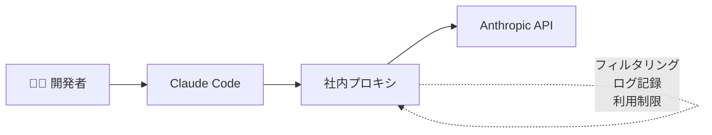
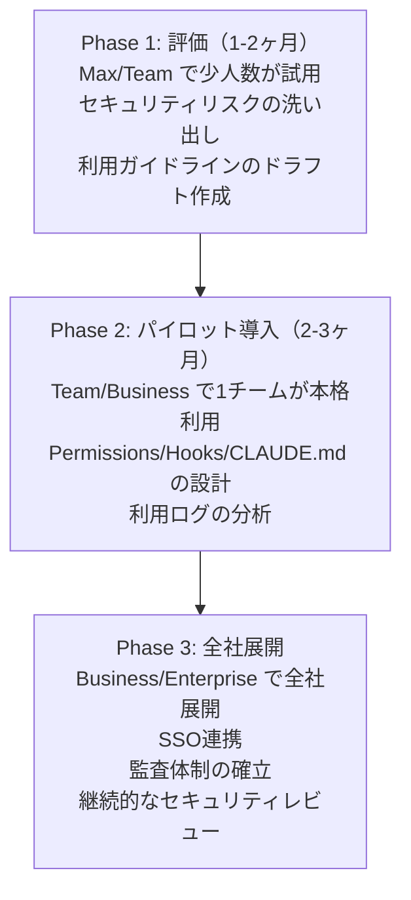

# 第3章 企業向けプラン比較 -- Business/Enterprise/Max/APIの選定基準

## この章で学ぶこと

- Anthropicが提供する各プランのセキュリティ機能の違い
- 企業規模・業種ごとの推奨プラン
- API経由利用とファーストパーティ利用の比較
- プラン選定チェックリスト
- コスト試算の考え方

---

## 前章の振り返りと本章の位置づけ

前章では、Claude Codeのデータフローを解説し、「何がどこに送信されるか」を明らかにした。プランによってデータの取り扱いが異なることも確認した。

本章では、その違いを深掘りし、自社に最適なプランを選定するための具体的な基準を示す。

「とりあえずEnterpriseにすれば安心」と思うかもしれないが、それは必ずしも正解ではない。企業の規模、業種、取り扱うデータの機密性、予算によって最適解は変わる。


## プラン一覧と概要

Anthropicが提供するClaude関連のプランは、大きく以下に分かれる（2026年4月時点）。

> 2026年4月時点の情報です。最新の価格はAnthropicの公式サイト（https://www.anthropic.com/pricing）をご確認ください。

| プラン | 月額目安 | 対象 | Claude Code対応 |
|--------|---------|------|----------------|
| Free | $0 | 個人 | 制限あり |
| Pro | $20/ユーザー | 個人 | 利用可能 |
| Max | $100-200/ユーザー | 個人〜小規模チーム | 利用可能 |
| Team | $30/ユーザー | チーム | 利用可能 |
| Business | 要問合せ | 企業 | 利用可能 |
| Enterprise | 要問合せ | 大企業 | 利用可能（カスタム対応） |
| API | 従量課金 | 開発者 | ANTHROPIC_API_KEY設定で利用可能 |

Free/Proは企業利用には不適切なため、本章ではMax、Team、Business、Enterprise、APIの5つを比較する。


## セキュリティ機能の詳細比較

### データプライバシー

| 機能 | Max | Team | Business | Enterprise | API |
|------|-----|------|----------|-----------|-----|
| トレーニング不使用 | Yes | Yes | Yes | Yes | Yes |
| データ保持期間の交渉 | No | No | 可能 | 可能 | No（30日固定） |
| ゼロデータリテンション | No | No | No | 交渉可能 | No |
| データ処理契約（DPA） | No | No | Yes | Yes | 限定的 |
| データリージョン指定 | No | No | 要確認 | 可能 | No |

### アクセス制御

| 機能 | Max | Team | Business | Enterprise | API |
|------|-----|------|----------|-----------|-----|
| SSO/SAML | No | No | Yes | Yes | 該当なし |
| SCIM（ユーザー自動管理） | No | No | 要確認 | Yes | 該当なし |
| 管理者コンソール | No | Yes | Yes | Yes | 該当なし |
| ロールベースアクセス制御 | No | 基本的 | Yes | カスタム | 該当なし |
| IPアドレス制限 | No | No | 要確認 | Yes | 該当なし |

### 監査・コンプライアンス

| 機能 | Max | Team | Business | Enterprise | API |
|------|-----|------|----------|-----------|-----|
| 利用ログの確認 | 個人のみ | チーム単位 | 組織単位 | 詳細+エクスポート | APIログ |
| 監査レポート | No | No | 要確認 | Yes | No |
| SOC2対応 | 不明 | 不明 | Yes | Yes | Yes |
| コンプライアンス認証 | 限定的 | 限定的 | Yes | カスタム | 限定的 |
| SLA | No | No | Yes | カスタム | Yes |


## API経由利用のメリットとデメリット

Claude CodeはANTHROPIC_API_KEYを設定することで、Anthropic APIを直接利用できる。この方式は企業利用において独自のメリットがある。

### メリット

**1. コスト制御の精密さ**

API従量課金のため、使用量に応じた精密なコスト管理が可能だ。

```bash
# API利用の設定
export ANTHROPIC_API_KEY=sk-ant-xxxxx

# コスト目安（Claude Sonnet 4の場合、2026年4月時点）
# 入力: $3 / 1M tokens
# 出力: $15 / 1M tokens
# 1日の利用量目安: 100K tokens → 約$1.80/日/人
```

月額固定のMax（$100-200/ユーザー）と比較すると、利用頻度が低い〜中程度のチームではAPIの方がコスト効率がよい場合がある。

**2. プロキシサーバーの設置**

APIの前段にプロキシサーバーを設置することで、企業独自のセキュリティポリシーを強制できる。



この構成は第8章で詳しく解説する。

**3. トレーニング不使用が保証される**

APIの利用規約では、デフォルトでデータがトレーニングに使用されないことが明記されている。

### デメリット

**1. 管理コンソールがない**

APIにはチーム管理のコンソールがないため、誰がどれだけ使っているかの可視化は自前で構築する必要がある。

**2. SSOの統合ができない**

API Key方式のため、社内のSSO/SAML基盤との統合はできない。APIキーの管理は自社で行う必要がある。

**3. 30日間のデータ保持**

安全性評価のために30日間データが保持される。保持期間の短縮を交渉することはできない（Enterpriseプランとの違い）。


## 企業規模・業種別の推奨プラン

### スタートアップ（〜50人）

**推奨: Max or API**

→ 少人数のため管理コンソールの必要性が低い
→ コスト効率を優先
→ 機密性の高いデータを扱わない場合はMaxで十分
→ 独自のセキュリティ制御が必要ならAPI + プロキシ

### 中小企業（50〜300人）

**推奨: Team or Business**

→ チーム管理機能が必要
→ SSOの導入が検討される規模
→ 50人以上なら管理コンソールの価値が大きい
→ データの機密性に応じてBusinessを検討

### 大企業（300人〜）

**推奨: Business or Enterprise**

→ SSO/SCIM連携が必須
→ 監査レポートの提出が必要
→ コンプライアンス認証の証跡が必要
→ データリージョン指定が求められる場合がある
→ SLA保証が必要

### 金融・医療・官公庁

**推奨: Enterprise（必須）**

→ ゼロデータリテンションが必要な場合がある
→ 業界固有のコンプライアンス要件
→ カスタムSLA
→ データ処理契約のカスタマイズ
→ 専任サポートチーム


## プラン選定チェックリスト

以下のチェックリストに回答することで、自社に最適なプランを特定できる。

```markdown
## プラン選定チェックリスト

### 必須要件
- [ ] トレーニングへのデータ不使用が必要か → Yes: Max/Team以上
- [ ] SSOの統合が必要か → Yes: Business以上
- [ ] 監査レポートが必要か → Yes: Business以上
- [ ] データリージョン指定が必要か → Yes: Enterprise
- [ ] ゼロデータリテンションが必要か → Yes: Enterprise
- [ ] カスタムSLAが必要か → Yes: Enterprise

### コスト要件
- [ ] ユーザー数: ___人
- [ ] 1人あたりの月間利用量（推定）: ___tokens
- [ ] 月額予算: ___円

### 運用要件
- [ ] 管理コンソールでのユーザー管理が必要か → Yes: Team以上
- [ ] 利用ログのエクスポートが必要か → Yes: Business以上
- [ ] 独自のプロキシサーバーを設置したいか → Yes: API
- [ ] SCIM連携が必要か → Yes: Enterprise

### 結果
- 必須要件で「Enterprise」が1つでも該当 → Enterprise
- 必須要件で「Business」が1つでも該当 → Business
- 運用要件で「Team」が該当 → Team
- コスト最適化を優先 → API or Max
```


## コスト試算の考え方

### Max vs API のコスト比較

10人のエンジニアチームで比較する。

**Maxプランの場合**
→ $100/ユーザー/月 x 10人 = $1,000/月
→ 年間: $12,000

**APIの場合（中程度の利用）**
→ 1人あたり1日 200K tokens（入力150K + 出力50K）
→ 入力: 150K x $3/1M = $0.45/日
→ 出力: 50K x $15/1M = $0.75/日
→ 合計: $1.20/日/人
→ 10人 x $1.20 x 22営業日 = $264/月
→ 年間: $3,168

**APIの場合（ヘビー利用）**
→ 1人あたり1日 1M tokens（入力750K + 出力250K）
→ 入力: 750K x $3/1M = $2.25/日
→ 出力: 250K x $15/1M = $3.75/日
→ 合計: $6.00/日/人
→ 10人 x $6.00 x 22営業日 = $1,320/月
→ 年間: $15,840

この試算からわかるように、中程度の利用ならAPIの方が大幅にコスト効率がよい。一方、ヘビーユーザーが多いチームではMaxの方が安くなる可能性がある。

### 隠れコスト

API利用時の隠れコストも考慮する必要がある。

- プロキシサーバーのインフラ費用
- ログ管理・監視ツールの費用
- APIキー管理の運用コスト
- 利用量の急増時のコストスパイク

### 筆者の実例

筆者の合同会社ジョインクラスでは、以下の構成で運用している。

**利用プラン**: Max（個人利用） + API（自動化エージェント用）

**月額コスト**:
→ Max: $100/月
→ API: 約$50-100/月（自動化タスクの量による）
→ 合計: 約$150-200/月

**この構成を選んだ理由**:
1. 1人法人のため管理コンソールは不要
2. 対話的な開発はMaxの方が快適（レート制限が緩い）
3. 自動化エージェントはAPIの方がコスト効率がよい
4. 両方ともトレーニング不使用が保証される


## ハイブリッド構成の提案

筆者が企業に推奨することが多いのは、ハイブリッド構成だ。

**ハイブリッド構成**

**対話的な開発作業** → Business/Enterpriseプラン
- SSO連携
- 管理コンソール
- 監査ログ

**CI/CD・自動化タスク** → API（社内プロキシ経由）
- コスト最適化
- プロキシでセキュリティ制御
- 利用量の細かい制御

**評価・検証フェーズ** → Max/Teamプラン
- 導入前の検証に利用
- 小規模チームでの試用
- 本格導入後にBusiness移行

この構成のポイントは、全ての利用パターンで「トレーニングに使用されない」条件を満たしつつ、コストを最適化できることだ。


## プラン移行のロードマップ

多くの企業では、段階的にプランをアップグレードしていくのが現実的だ。



次の第4章では、いよいよ具体的なセキュリティ設計に入る。まず最も基本的な「アクセス制御とPermissions設計」から始めよう。

---

## まとめ

- 企業利用ではMax/Team以上が最低ライン。機密データを扱う場合はBusiness以上を推奨
- API経由利用はコスト制御とプロキシ設置のメリットがあるが、管理機能は自前で構築が必要
- 金融・医療・官公庁はEnterprise一択
- ハイブリッド構成（対話的開発: Business + 自動化: API）がコスト効率と安全性を両立できる
- 段階的にプランをアップグレードするロードマップが現実的

:::message
**本章の情報はClaude Code 2.x系（v2.1.90）（2026年4月時点）に基づいています。** Claude Codeのメジャーアップデート時に改訂予定です。最新情報は[Anthropic公式ドキュメント](https://docs.anthropic.com/en/docs/claude-code)をご確認ください。
:::

> Claude Codeの多様な活用パターンを知りたい方は「[Claude Codeマルチエージェント開発](https://zenn.dev/joinclass/books/claude-code-multi-agent)」をご覧ください。エージェント構成ごとのセキュリティ考慮点も参考になります。
